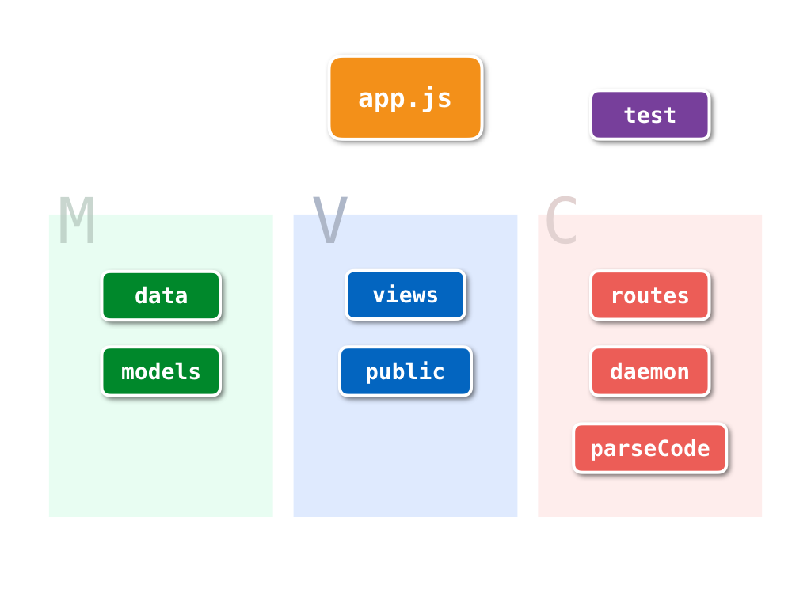

# Howhoworg

<h1 align="center">
	
</h1>

> A versatile fund server for quantity analysis and machine learning.

## Introduction
Howhoworg is a versatile fund server build from [Node.js](https://nodejs.org) and [MongoDB](https://www.mongodb.com). Update fund nav and other data daily and automatically from several reliable sources.

## Requirements
- [Node.js](https://nodejs.org) **6.1+**
- [npm](https://www.npmjs.com) **3.10.3+** or [yarn](https://yarnpkg.com) **0.15.1+**

## Coding Style
We're using **[Airbnb JavaScript Style Guide](https://github.com/airbnb/javascript)** without semicolons. Let us refer you to [here](https://github.com/airbnb/javascript/tree/master/packages/eslint-config-airbnb) to get eslint setup, then take a look at our [.eslintrc](https://github.com/HowFintech/howhoworg/blob/master/.eslintrc).

## Setup
Step 1. Click the top right `fork` button to fork this repository to your account.

Step 2. Clone this object on your client.

```
git clone https://github.com/<your_user_name>/howhoworg.git
```
Step 3. Check in your directory and install dependencies.

```
npm install
```
or

```
yarn
```

## Architecture

<h5 align="center">
	
</h5>

So called **MVC (Model-View-Controller)** architecture, we have several groups in the picture above.

### app.js
Entry point, Starting API Server and updaters to crawl market data from several sources.

### test
Unit Test is matter! It helps you really understand the design of the code you are working on. Keep coverage higher as you can.

### data
Some legacy temporary data put in here, like fund clear id list, tej csv test files, and other json files.

### models
Schema, classes and its method we use in database would be put here.

### views & public
*.ejs files and web page static files.

### routes
Web page routing and Restful API stuff, including database connecting, data handling, authorization. You can click [here](http://howfintech.com/api/docs) to check out API Docs.

### daemon
Howhoworg has several updaters running constantly, and update market data to database everyday morning.

### parseCode
Legacy code, most of them are using for parsing api data and test data.


## Usage
```
node app

```

## Testing
```
npm test
```

## API Spec
Go to [here](http://howfintech.com/api/docs) to check API Docs.


## Trial
Go to [here](http://howfintech.com/example) to get alpha free trial.
